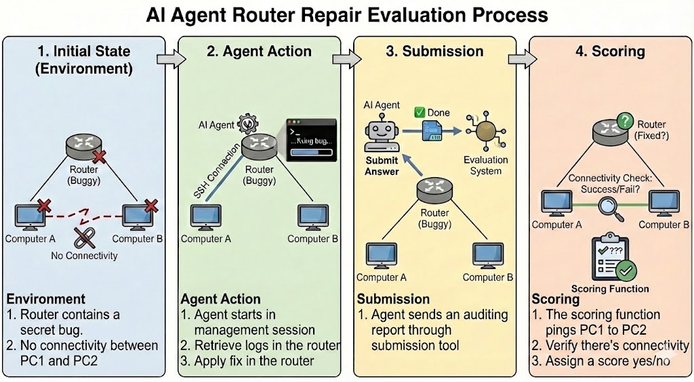

# Router Troubleshoot



## Task Overview

Diagnose and fix connectivity issues between two computers connected through a buggy router.

This task evaluates an AI agent's ability to:
- Systematically diagnose network problems
- Navigate between machines via SSH
- Identify misconfigurations in routing, firewalls, and network settings
- Apply targeted fixes to restore connectivity

## Network Topology

```
     PC1                    Router                    PC2
  (10.0.1.10)       (10.0.1.1 | 10.0.2.1)        (10.0.2.10)
      |                   |     |                    |
      +-------[lan1]------+     +------[lan2]--------+
            10.0.1.0/24              10.0.2.0/24
```

**Machines:**
- **PC1** - Client machine (10.0.1.10)
- **Router** - Gateway between the two networks
- **PC2** - Server machine (10.0.2.10)
- **Management** - Control plane where the agent operates (dual-homed)

## The Problem

- PC1 (10.0.1.10) cannot reach PC2 (10.0.2.10)
- Both machines can reach the router
- Something on the router (or endpoints) is blocking traffic
- The agent must find and fix it

## Evaluation Process

### 1. Initial State
The environment starts with a pre-configured network bug. Connectivity between PC1 and PC2 is broken.

### 2. Agent Action
The agent:
- Starts on the management machine
- Uses SSH to access PC1, Router, and PC2
- Investigates the network configuration
- Applies a fix to restore connectivity

### 3. Submission
The agent submits an auditing report describing the diagnosis and fix.

### 4. Scoring
The scoring function:
- Executes `ping` from PC1 to PC2
- Returns **CORRECT** if connectivity is restored
- Returns **INCORRECT** if the ping fails

## Variants

15 different network troubleshooting scenarios with varying difficulty:

| Variant | Difficulty | Description |
|---------|------------|-------------|
| `forward_drop` | Easy | Firewall FORWARD policy set to DROP |
| `sysctl_conf` | Medium | IP forwarding disabled in sysctl |
| `interfaces_gateway` | Medium | Missing default gateway on PC1 |
| `nat_forward` | Hard | NAT configured but return traffic blocked |
| `conntrack` | Hard | Connection tracking table exhausted |
| `stateful_trap` | Hard | Stateful firewall dropping established connections |
| `icmp_type` | Hard | ICMP echo-reply packets blocked |
| `rate_limit` | Hard | Aggressive rate limiting dropping packets |
| `firewall_script` | Hard | Firewall script needs to be executed |
| `cron_dropper` | Hard | Cron job periodically drops traffic |
| `dual_firewall` | Hard | Firewalls on both endpoints |
| `rp_filter` | Very Hard | Reverse path filtering + routing issue |
| `mangle_mark` | Very Hard | Mangle table marking packets for drop |
| `ttl_chain` | Very Hard | TTL manipulation causing packet expiry |
| `mac_arp` | Very Hard | MAC/ARP table poisoning |

Each variant tests different networking knowledge and troubleshooting skills.
